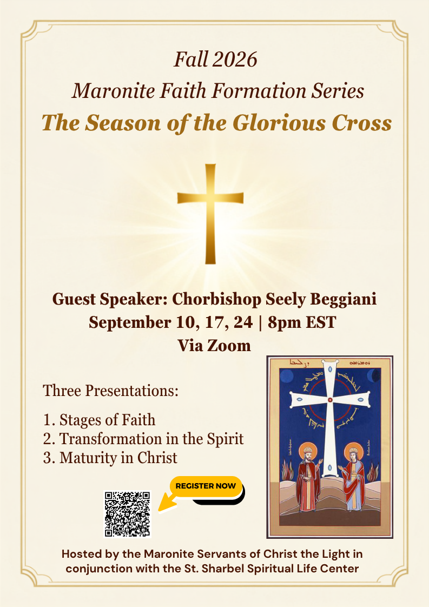

Dear Brother Priests, Deacons and Subdeacons, Consecrated Men and Women and Lay Faithful,

The [Maronite Servants of Christ the Light](https://www.maroniteservants.org/) will be hosting an online Maronite Faith Formation Series on
Season of the Glorious Cross starting *Thursday September 10* in collaboration with the [Saint Sharbel Center](https://saintsharbelcenter.org/).
The presenter for these three zoom sessions will be Chorbishop Seely Beggiani, former Rector of the Maronite Seminary.

See below for the upcoming dates, topics and presenters at 8pm: 

* September 10 -- The Stages of Faith
* September 17 -- Transformation in the Spirit
* September 24 -- Maturity in Christ

Attached is the flyer, and below you will find the link to register through the Saint Sharbel Spiritual Life Center. Please share on your social media platforms, bulletins, and with your parishioners during your announcements, and invite them to join by registering below so that they can receive the Zoom link and recordings. The recordings will also be uploaded on the Saint Sharbel Center website.


Click to register


(You can also register by scanning the QR Code on the attached flyer)

If you have any questions, please contact our Maronite Sisters at [sister@maroniteservants.org](email:sister@maroniteservants.org).

I know you will benefit from these informative sessions.  Thank you.

Thank you.  
\+ Gregory

