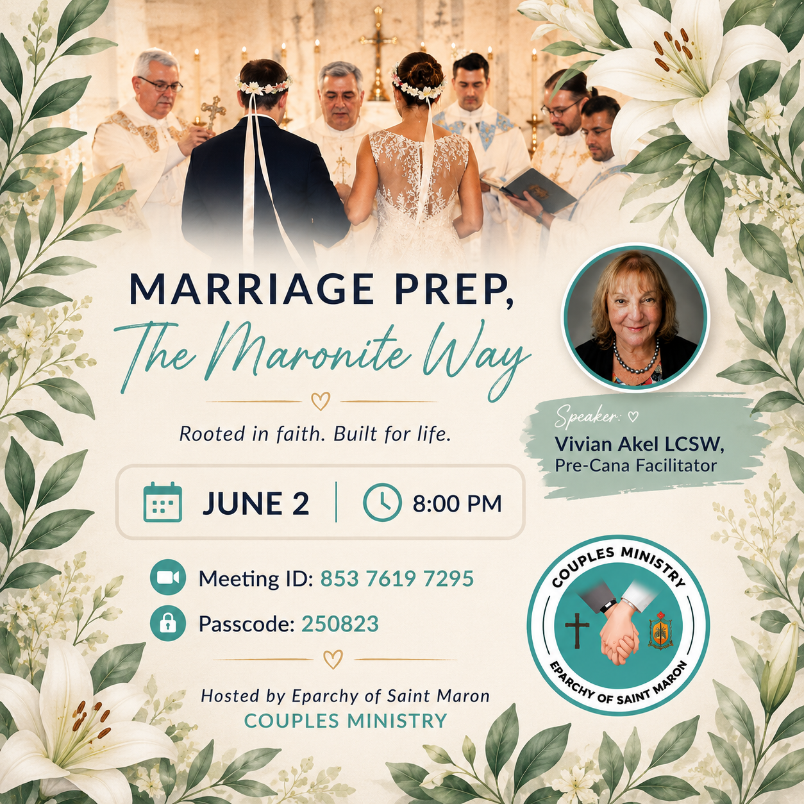

In circular 26-28, *Bishop Gregory writes:*

Dear Brother Priests, Deacons/Subdeacons, Consecrated Men and Women,

The Mystery of Crowning is a lifelong partnership between a man, and a woman before God. Accompanying a couple, as they prepare for the wedding ceremony, and their whole life together, is an important aspect of marriage preparation.

The Eparchial Couples Ministry will host a Zoom meeting on Tuesday, June 2 at 8:00 pm to highlight and discuss the many facets of marriage preparation.

I encourage all to make an effort to attend and participate in this meeting, as well as to encourage as many parishioners as possible to attend as well.

+ Gregory

