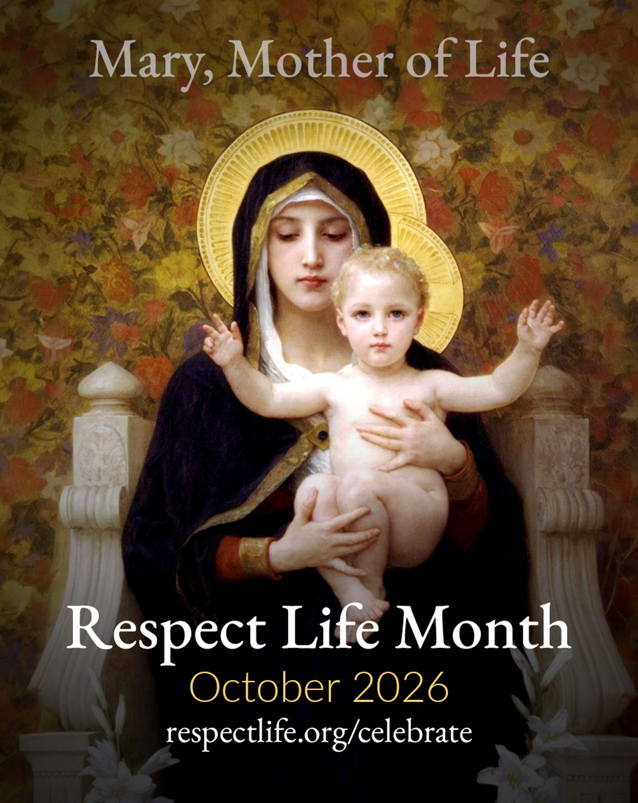

Dear Brother Priests, Deacons and Subdeacons, Consecrated Men & Women, Lay Faithful,

As we prepare to enter the month of October, I invite all our parishes to observe Respect Life Month in a special way. October provides us with an opportunity to renew our commitment to the dignity and sacredness of every human life, from conception to natural death, and to bring this intention before the Lord in our prayers and liturgies.

In particular, I encourage our parishes to dedicate time throughout the month to pray for the unborn, for mothers facing difficult pregnancies, and for all those who are vulnerable and in need of our support and compassion. As a Church, we are called not only to proclaim the sanctity of life, but also to accompany women and families with love, mercy, and practical support.

Since this year's theme is "Mary, Mother of Life," a beautiful way to foster this spirit of prayer in our parishes is to use of the Pregnant Mother Mary Statue and Expectant Mother Prayer Cards. These can be placed in a special location in the church or chapel throughout the month of October, inviting parishioners to pause, pray, and entrust mothers and their unborn children to the loving intercession of the Blessed Mother. 

I would like to encourage each parish to consider obtaining the statue and prayer cards and incorporating them into your parish's observance of Respect Life Month. They may be used in a chapel, near an icon of the Blessed Mother, or in another appropriate place where parishioners can be encouraged to pray.

### The statue may be found here:
[mary-mother-of-jesus-statue-B3771](https://www.autom.com/product/mary-mother-of-jesus-statue-B3771)

### The Expectant Mother Prayer Cards may be found here:
[expectant mother prayer cards](https://www.autom.com/shop/?search_query=expectant+mother+prayer+cards&fallbackQuery=expectant+mothers+prayer+cards)

I hope that these simple yet meaningful resources will help our parishes create a visible and prayerful witness to the sanctity of human life. Above all, may October be a time when we unite our prayers as an Eparchy, asking the Lord to protect every unborn child, strengthen every mother, comfort families who are struggling, and deepen within each of us a greater love and respect for the gift of life.

May the Blessed Virgin Mary, Mother of God and Mother of Life, intercede for all mothers and their children. May she teach us to cherish every human person as a precious gift from God and to respond to those in need with the compassion of Christ.  

Additionally, the attached flyer can be added in your parish bulletin or on your parish bulletin board to help promote prayers throughout the month.

With prayers and gratitude for your continued dedication to building a culture of life. 

\+ Gregory

