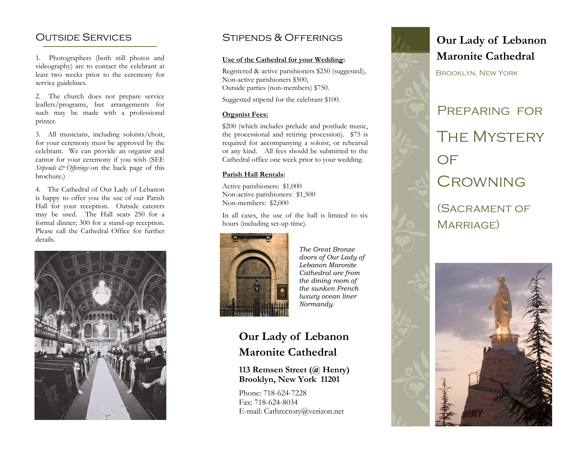

## Norms for Marriage

The pastor of a parish is the father of his spiritual family and has certain responsibilities toward his children. That is why the faithful call their parish priest “Father” (Abouna). As such, it is the priest’s duty to remind the engaged couple that among their other responsibilities, spiritual ones must play a major role. For this reason, the following norms have been established.

1. The couple makes an appointment with the priest to schedule a meeting with him at least six months before they plan to marry.

2. At that initial meeting, the priest will determine if both parties are able to have the Mystery of Crowning (Sacrament of Marriage) celebrated in the Catholic Church.
He will also determine if they are eligible to be married in the parish. At least one of them much be a registered parishioner.
He must make his determinations based on what he has witnessed and on information to which he has access.
More specifically, he must see if both parties (or at least one of them) are *registered parishioners* of his parish.
In and of itself that shows at least, that they have the intention of being a part of the local “family of Faith.”
Through parish registration, parishioners have the privilege of receiving all of the spiritual benefits offered by the Church through their parish priest.
Of those, the most important, of course, is the reception of the Mysteries (Sacraments).
On the other hand, a registered parishioner is also bound by certain other obligations: *attending the Divine Mysteries at the parish church on a regular basis*,
thereby contributing to the spiritual bond which ties the parish family together; and using the weekly offering envelopes thereby contributing to the *temporal* responsibilities of the parish.

3. Seeing that a Marriage is a celebration of a Sacrament, the Church prescribes that it is to be celebrated in a sacred place, that is, in the parish church (not in a private home, reception hall, garden, etc.).
Marriages are usually celebrated on Saturdays but arrangements for weekday Marriages can also be made with the priest.
It is customary that an appropriate donation, according to the means of the couple, be made to the parish church and a stipend given to the priest who celebrates the Marriage.

4. If the priest sees that the couple is able to be married in the parish church, at the end of that meeting, and not before, a tentative wedding date can be established.
The date is tentative because it depends upon the fulfillment of all of the marriage requirements listed below:

- [ ] Both parties must present an original Certificate of Baptism. This certificate cannot be more than six months old and can easily be obtained by contacting the church of baptism.

- [ ] If one of the parties is not a member of the parish, a letter from their parish priest must be presented stating that they have never been married. If the party is unknown to the parish priest, then two witnesses, who have known the party for several years, must come to the priest to sign affidavits that the party has never been married before, either in a Catholic ceremony, another church ceremony, or by the civil authorities.

- [ ] The couple must attend together the marriage preparation classes required by the Church. Information regarding these classes will be given to the couple by the priest.

- [ ] A civil marriage license from the civil authorities, must be given to the priest at least seven days prior to the celebration of the marriage.

### Other Considerations

1.  Music for the ceremony must be liturgical in nature (no pop tunes or movie themes) and must be approved by the celebrating priest.
Recorded music may not be used in the church.

2.  Wedding dresses for the bride and her attendants must be modest (no bare shoulders or plunging necklines), or include a jacket.

3.  Flowers for the church should be appropriately placed in consultation with the celebrant.

4.  Confetti, rice, balloons, bubbles, doves, unity candles and anything else that detracts from the sacredness of the Sacrament are not permitted in or outside the church.

5.  The Parish schedule is usually very tight so the parties must be on time for the celebration of their wedding. In consideration of practical circumstances and as a matter of courtesy, the priest and the guests should not have to wait more than 10 minutes for the bride to arrive.

6.  Marriages are never celebrated during Lent, unless there is a very serious reason to do so.

### Outside Services
1.  Photographers (both still photos and videography) are to contact the celebrant at least two weeks prior to the ceremony for service guidelines.

2.  The church does not prepare service leaflets/programs, but arrangements for such may be made with a professional printer.

3.  All musicians, including soloists/choir, for your ceremony must be approved by the celebrant. We can provide an organist and cantor for your ceremony if you wish (SEE Stipends & Offerings on the back page of this brochure.)

4.  The Cathedral of Our Lady of Lebanon is happy to offer you the use of our Parish Hall for your reception. Outside caterers may be used. The Hall seats 250 for a formal dinner; 300 for a stand-up reception. Please call the Cathedral Office for further details.

### Stipends & Offerings

#### Use of the Cathedral for your Wedding:
* Registered & active parishioners $250 (suggested),
* Non-active parishioners $500,
* Outside parties (non-members) $750.
* Suggested stipend for the celebrant $100.

#### Organist Fees:
* $200 (which includes prelude and postlude music, the processional and retiring procession).
* $75 is required for accompanying a soloist, or rehearsal of any kind.
* All fees should be submitted to the Cathedral office one week prior to your wedding.

#### Parish Hall Rentals:
* Active parishioners: $1,000
* Non-active parishioners: $1,500
* Non-members: $2,000

In all cases, the use of the hall is limited to six hours (including set-up time).
